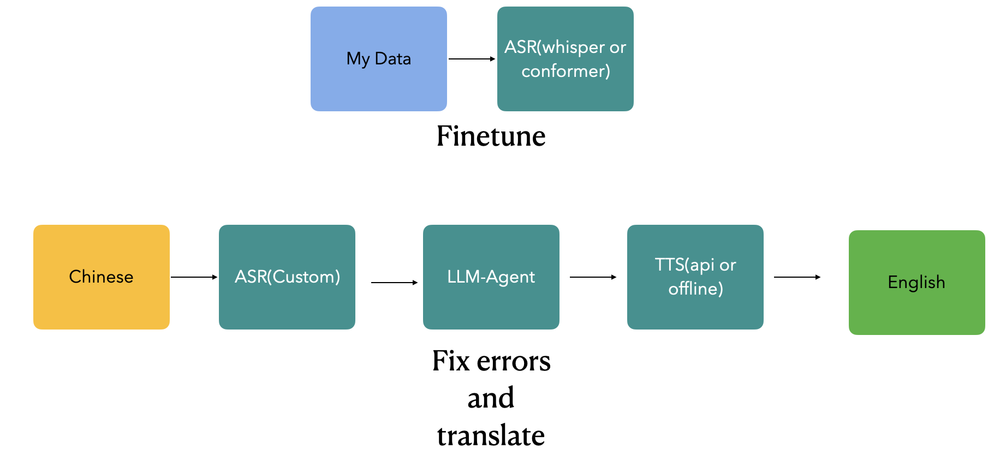

# ASR Server
I have trained a specially customized model using data from myself, and you can download the open-source version to try it out. ：）

## Start ASR Server
```
### Steps

1. Navigate to the ASR server directory:

   ```bash
   cd streaming_asr_server/paddlespeech
   ```

2. Run the startup script:

   ```bash
   bash server.sh
   ```

3. Execute the main ASR server program:

   ```bash
   python run.py
   ```

### Notes

- Make sure to install the required dependencies with:

  ```bash
  pip install -r requirements.txt
  ```

- If using different configuration files, replace `configs/config.py` in the above command with the path to the appropriate configuration file.

- If you want real-time translation in the meeting software, you need to install virtual microphone software (BlackHole is recommended), then modify the output device in the config, and select it in the meeting software.

### Acknowledgments

Thanks to the following projects and teams:

- [Whisper](https://github.com/facebookresearch/wav2letter): Advanced speech recognition model
- [PaddleSpeech](https://github.com/PaddlePaddle/PaddleSpeech): Baidu's open-source speech processing tools
- [Streaming Whisper](https://github.com/facebookresearch/wav2letter/tree/master/bindings/python): Extension for streaming speech recognition
